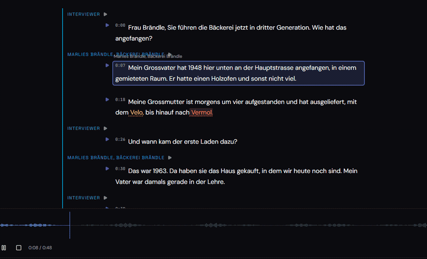
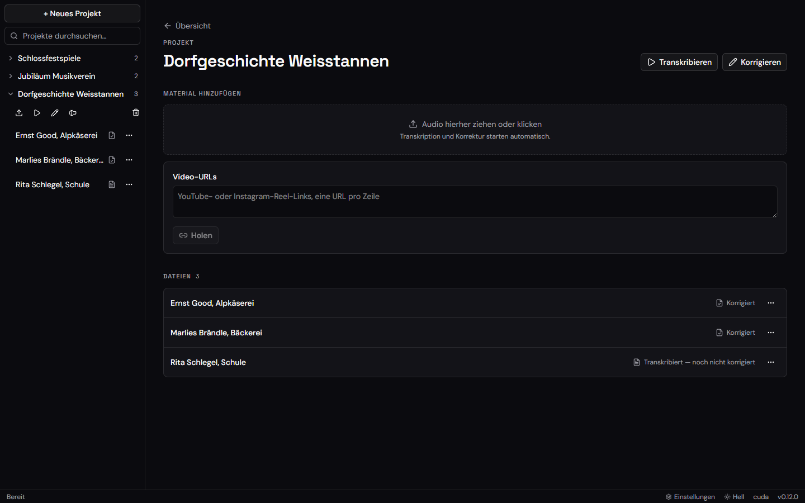
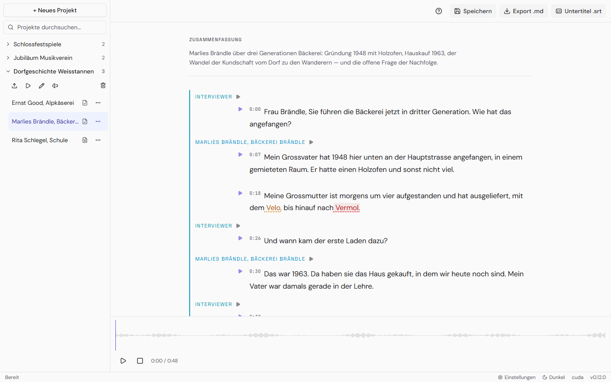

<div align="center">


# Transkribor

Interviews führen ist das eine — stundenlanges Abtippen das andere.

**Transkribor macht aus Interviews, Vorträgen und Videos lesbare, sprecher-markierte Transkripte — auf deinem eigenen Rechner.**

<a href="https://github.com/napoleonmm83/Transkribor/releases/latest"></a>
<a href="https://github.com/napoleonmm83/Transkribor/releases"></a>
<a href="LICENSE"></a>

<a href="https://github.com/napoleonmm83/Transkribor/releases/latest/download/Transkribor-Setup.exe"></a>
<a href="https://github.com/napoleonmm83/Transkribor/releases/latest/download/Transkribor-arm64.dmg"></a>
<a href="https://github.com/napoleonmm83/Transkribor/releases/latest/download/Transkribor.AppImage"></a>

<sub>Auch als <a href="https://github.com/napoleonmm83/Transkribor/releases/latest/download/Transkribor.deb">.deb</a> — ohne Auto-Update, das bietet das AppImage — <a href="https://github.com/napoleonmm83/Transkribor/releases/latest">alle Fassungen und Formate</a>.</sub>

<sub>Transkribor ist kostenlos — falls es dir Arbeit abnimmt, freue ich mich über eine <a href="https://github.com/sponsors/napoleonmm83">❤️ Unterstützung</a>.</sub>

<a href="#in-drei-schritten-loslegen">Loslegen</a> ·
<a href="#was-du-davon-hast">Funktionen</a> ·
<a href="#gefällt-es-dir">Unterstützen</a>



</div>

Du ziehst deine Audiodatei ins Fenster, der Rest passiert von selbst: Transkribor schreibt
mit, erkennt, **wer gerade spricht**, korrigiert falsch verstandene Wörter im Zusammenhang
und legt dir einen fertigen Text hin, den du direkt weiterverwenden kannst.

Gemacht für alle, die viel mit Gesprochenem arbeiten: Journalismus und Forschung, Podcast,
Vereins- und Firmenarchive — und für alle, die Vorträge festhalten oder ihren eigenen Videos
Untertitel mitgeben wollen (der YouTube-Import und der Untertitel-Export sind eingebaut).
Auch mit **Schweizerdeutsch** kommt es zurecht.

---

## In drei Schritten loslegen

1. **[Transkribor herunterladen](https://github.com/napoleonmm83/Transkribor/releases/latest)**
   und installieren.
2. Beim ersten Start richtet sich die App selbst ein — einmalig, im Normalfall 10–30 Minuten,
   und sie lädt mehrere Gigabyte. (Später kann gelegentlich ein Update Nacharbeiten mitbringen,
   meistens kleine, manchmal auch eine neue Fassung der Spracherkennung — erneut Gigabyte.)
   Der Knopf fragt einmal nach („nochmal klicken zum Start“); während des Vorgangs gibt es
   einen **Abbrechen**-Knopf. Ein abgebrochener Versuch richtet sich beim nächsten Start
   einfach wieder an, es geht nichts verloren.
3. Projekt anlegen, Audiodatei hineinziehen. Es öffnet sich ein Fenster, in dem du je
   Aufnahme Sprache und Anzahl Sprecher einstellen und **kurz reinhören** kannst — dreimal
   klicken, dann läuft alles von allein, und du siehst live, wie weit es ist. (Ein paar
   Projektnamen wie `active` oder `done` sind für die Fortschrittsanzeige reserviert — die
   App lehnt sie mit einer Meldung ab; eckige Klammern im Namen gehen ebenso nicht. Hat ein
   Projekt aus einer älteren Fassung so einen Namen, einmal umbenennen — es bleibt sonst nur
   lesbar, Bearbeiten und Neustarten sind gesperrt. Ab
   `v0.26.0`; in `v0.25.0` und älter liegen diese Felder direkt auf der Seite.) Ab
   `v0.27.0` steht schon im ersten Schritt, **was** du gewählt hast — Dateien mit
   Namen und Grösse, Video-Links mit ihrer Adresse; eine versehentlich mitgenommene nimmst
   du mit dem ✕ daneben wieder heraus, ohne von vorn anzufangen. (Ab `v0.28.0`
   bleibt dabei auch bei zwanzig Aufnahmen das Feld zum Hineinziehen sichtbar —
   geblättert wird nur in der Liste. Ab `v0.29.0` gilt dasselbe im zweiten
   Schritt: der Abspieler mit der Tonspur bleibt beim Blättern stehen, statt nach oben
   aus dem Bild zu wandern. Ab `v0.36.0` zeigt die Dateiliste während laufender
   Hintergrund-Jobs präzise und animiert an, woran gerade gerechnet wird: Globale
   Zwischenschritte wie die Glossar-Erstellung werden direkt bei den betroffenen
   Dateien genannt, während unbeteiligte Aufnahmen ihren echten Ruhezustand behalten —
   auch bei Einzeldatei-Aktionen wie „Neu transkribieren“ und mit durchgehend
   einheitlichen Statusbegriffen. Ab `v0.44.0` streamt die Korrektur-Pipeline Hardware-
   und KI-Phasen je Datei: Lokale rechenintensive Schritte wie Diarisierung laufen
   schonend nacheinander, während fertige Dateien sofort parallel an die Cloud-KI
   übergeben und schrittweise fertiggestellt werden.)

> [!WARNING]
> **Beim ersten Öffnen warnt das Betriebssystem.** Der Installer ist nicht bei Microsoft bzw.
> Apple registriert — das kostet Jahresgebühren, die ein kostenloses Projekt nicht trägt.
> Windows: *Weitere Informationen* → *Trotzdem ausführen*. macOS: Rechtsklick auf die App →
> *Öffnen*.



---

## Was du davon hast

**Deine Aufnahmen bleiben bei dir.** Das Zuhören und Mitschreiben passiert vollständig auf
deinem Rechner — ohne Konto, ohne Cloud, ohne Upload der Aufnahme. Nur wenn du die Korrektur
über einen Onlinedienst laufen lässt, verlässt der *Text* deinen Rechner.

<details>
<summary>Und die Textkorrektur?</summary>

Die Korrektur nutzt ein KI-Modell deiner Wahl. Wählst du dafür einen Onlinedienst, geht der
*Text* dorthin — wer das nicht will, nimmt ein lokales Modell (z. B. Ollama) oder lässt die
Korrektur ganz weg.

</details>

**Es erkennt, wer spricht.** Interviewer und Befragte werden getrennt und mit Namen versehen —
das Transkript liest sich wie ein Gespräch, nicht wie eine Textwand.

**Es korrigiert mitdenkend.** Ein Sprachmodell geht den Text im Zusammenhang durch: falsch
gehörte Ortsnamen, Fachbegriffe und Eigennamen werden geradegezogen, über alle Aufnahmen
eines Projekts hinweg einheitlich. Anschliessend prüft ein zweiter Durchgang, dass nichts
dazuerfunden oder weggelassen wurde.

**Du behältst das letzte Wort.** Im eingebauten Editor hörst du jeden Abschnitt per
Tastendruck nach und änderst, was nicht stimmt — unsichere Stellen sind farbig markiert, und
einen falsch verstandenen Namen tippst du **einmal** richtig: er zieht durchs ganze Dokument
bis in den Export. Gespeichert wird von selbst.

<details>
<summary>Mehr im Editor: finden, anmerken, rückgängig machen</summary>

**Stellen wiederfinden.** Das Suchfeld oben im Editor durchsucht das ganze Transkript: Treffer
bleiben hell, alles andere tritt in den Hintergrund, und mit `▲` `▼` springst du von Fundstelle
zu Fundstelle — bei mehreren tausend Wörtern die schnellste Art, „wo hat er genau das gesagt?“.
Die Schreibweise der Umlaute ist dabei egal: „Buehler“ findet „Bühler“ und umgekehrt, „Strasse“
auch „Straße“ — praktisch, weil in Transkripten beides durcheinander vorkommt.

**Auch Kontext und Zusammenfassung sind deine.** Die beiden Absätze über dem Gespräch schreibt
die KI — und sie stehen im Text-Export ganz oben, also liest sie jeder zuerst. Ein Klick
darauf öffnet sie zum Bearbeiten; ist noch nichts da, legst du sie an derselben Stelle selbst
an. Damit lässt sich auch ein älteres Transkript geradeziehen, in dem noch ein falsch
verstandener Name steht. Willst du einen der beiden Absätze ganz loswerden, löschst du einfach
den Text — leer heisst gestrichen.

**Offene Punkte abhaken.** Ganz unten unter „Anmerkungen“ sammelt die KI, was sie *nicht* raten
wollte — also genau die Stellen, an denen sich Nachhören lohnt. Die Liste gehört dir: eine
Anmerkung geradeziehen, eine erledigte streichen (Text löschen genügt) oder eine eigene
ergänzen. Und zu einem einzelnen Satz im Gespräch legst du über das Sprechblasen-Symbol eine
Notiz an — „hier nachfragen“ steht dann direkt bei der Stelle und im Export mit unter den
Anmerkungen.

**Versehentlich etwas gestrichen?** Ob Anmerkung, Notiz, Kontext oder Zusammenfassung: es
blendet sich kurz ein Hinweis ein, der den gestrichenen Text nennt — ein Klick auf
„Rückgängig“ holt ihn zurück.

</details>

**Es sagt dir, wo es nichts gehört hat.** Manchmal überspringt die Spracherkennung ein Stück
Aufnahme — nicht falsch verstanden, sondern gar nicht angefasst; im Text steht dann einfach
nichts, wo jemand etwas gesagt hat. Transkribor hält die Länge der Aufnahme gegen das, was
tatsächlich im Transkript steht, und meldet oben im Editor jede Stelle mit Zeitangabe, an der
länger als eine Viertelminute nichts angekommen ist. Ob dort wirklich etwas fehlt, hörst du
in Sekunden nach — von allein wäre es dir kaum aufgefallen.

**Videos direkt aus dem Netz — und Untertitel zurück.** YouTube- oder Instagram-Adresse
einfügen genügt, Transkribor holt sich die Tonspur selbst. Und ein Klick erzeugt die
`.srt`-Untertitel, die du bei YouTube hochlädst und die dort die schwachen Automatik-Untertitel
ersetzen — mit oder ohne Sprechernamen.

<details>
<summary>Wie Transkribor den Video-Import instand hält</summary>

YouTube und Instagram bauen ihre Seiten ständig um, wovon der Downloader jedes Mal aus dem
Tritt kommt. Transkribor frischt ihn deshalb von sich aus auf, und zwar **beim Start im
Hintergrund** — du merkst davon im Normalfall nichts; nachsehen (und abschalten) kannst du es
unter **Einstellungen › Video-Import**.

- Fügst du eine Adresse ein, während im Hintergrund noch aufgefrischt wird, sagt Transkribor
  das und bittet dich, es gleich noch einmal zu versuchen.
- Geht ein Download trotzdem schief, weil die Seite sich gerade wieder geändert hat,
  aktualisiert es sofort und versucht es gleich noch einmal.
- Machst du das Fenster mitten in einer Auffrischung zu, ist das meistens folgenlos. Bricht
  dagegen die allererste Installation ab, hilft **Einstellungen › Video-Import › Jetzt
  aktualisieren**.
- Und wenn der Downloader dabei so zerbricht, dass Transkribor ihn danach gar nicht mehr
  findet, merkt es sich den abgebrochenen Versuch und setzt ihn beim nächsten Start fort
  (solange die automatische Auffrischung eingeschaltet ist).
- Zusätzliche Programme brauchst du dafür keine — YouTube verlangt beim Herunterladen
  inzwischen, dass ein kleines Stück Javascript ausgeführt wird, und Transkribor bringt alles
  Nötige dafür mit.

</details>

**Auf einen Blick, solange es überschaubar bleibt.** Hast du bis zu acht Projekte, zeigt dir
die Startseite jedes davon als eigene Kachel statt einer schmalen Zeile mit viel Leerraum
darunter: mit Anzahl der Aufnahmen, wie viele davon schon fertig sind, einem Fortschrittsbalken
für den Stand des Projekts und — läuft gerade etwas — womit Transkribor gerade beschäftigt ist.
Kommen mehr Projekte dazu, wechselt die Übersicht ab dem neunten wieder auf eine knappe Liste
der letzten fünf; alle deine Projekte findest du dann jederzeit vollständig in der Seitenleiste.
*(Ab `v0.49.0`.)*

**Ordnung, auch nach hundert Aufnahmen.** Projekte und Aufnahmen lassen sich jederzeit
umbenennen — beim Umbenennen einer Aufnahme bietet dir Transkribor die Namen der Sprecher an,
sodass aus `01172464` ein „Hans Müller, Garage Rüthi“ wird. Suchfeld und `Strg+K` führen dich
auch in grossen Sammlungen mit einem Griff zum richtigen Projekt. Am Tablet und am
Touch-Bildschirm sind die `⋯`-Knöpfe ab `v0.49.0` dauerhaft sichtbar: bisher
erschienen sie nur beim Darüberfahren mit der Maus oder wenn du sie mit der Tastatur
ansteuertest — mit dem Finger allein waren sie nicht zu sehen, und zum Umbenennen oder
Löschen musstest du das Projekt erst öffnen. Dasselbe gilt für die Sprecherauswahl im
Editor.

**Es wartet nicht auf dich.** Aufnahmen werden nacheinander abgehört, die Korrektur läuft
danach für mehrere gleichzeitig, und mehrere Projekte laufen ohnehin nebeneinander — du
kannst weiterarbeiten oder das Fenster zumachen.

Neue Aufnahmen kannst du dabei jederzeit dazulegen — auch mitten in einem laufenden Lauf.
**Ab `v0.50.1`** siehst du auch bei diesen Aufnahmen in der Liste, woran
Transkribor gerade arbeitet. In Fassungen bis einschliesslich `v0.50.0` stand bei ihnen bis
zum Ende des ganzen Laufs nur das Wartesymbol, obwohl sie längst abgehört und korrigiert
wurden — und in der Meldung am Ende des Laufs tauchten sie gar nicht erst auf.

Auch **bevor** sie an der Reihe sind, stehen sie ab `v0.50.1` als wartend in der Liste
statt weiter wie unbearbeitetes Audio auszusehen. Das greift, sobald die Aufnahme fertig
ist, an der Transkribor gerade arbeitet — bei einer langen Aufnahme kann das also ein paar
Minuten dauern.

**Ab der nächsten Fassung** sagt diese Zeile in der Dateiliste des Projekts auch, *worauf*
gewartet wird und wie viel noch davor liegt: „Wartet auf Transkription · noch 3 vor dieser“ —
und entsprechend „Wartet auf Korrektur“, wenn du die Korrektur von Hand angestossen hast. In
Fassungen bis einschliesslich `v0.50.2` stand dort nur „In Warteschlange“; bei fünfzehn
Aufnahmen sah die erste damit genauso aus wie die letzte. Die Zahl ist eine Menge, keine
Platznummer: beim Korrigieren arbeitet Transkribor mehrere Aufnahmen gleichzeitig. In der
schmalen Dateileiste des Editors bleibt es beim kurzen „In Warteschlange“ — dort würde der
längere Text die Dateinamen verdrängen.

Solange eine solche Aufnahme zum laufenden Lauf gehört, lässt sie sich nicht umbenennen und
nicht neu transkribieren; Transkribor sagt dann „wird gerade bearbeitet — bitte warten“.
Löschen geht weiterhin, solange gerade nicht an ihr gerechnet wird.

Wie viele Aufnahmen gleichzeitig korrigiert werden, stellst du seit `v0.32.0` selbst ein,
unter **Einstellungen › Tempo der Korrektur** (in Fassungen bis einschliesslich `v0.31.0`
sind es fest drei). Mehr heisst: ein grosses Projekt ist früher fertig — **und es kostet
dich nicht mehr**. Es sind dieselben Anfragen, nur dichter hintereinander; wie viele es
werden, hängt an Zahl und Länge deiner Aufnahmen, nicht an dieser Einstellung. Was sich
ändert, ist das Tempo: nutzt du ein Abo von Claude oder ChatGPT, kann ein Nutzungslimit
dadurch früher greifen, und bei einem eigenen Schlüssel treffen mehr Anfragen gleichzeitig
ein.

Gemessen an vier Aufnahmen: mit **vier** Anfragen gleichzeitig statt einer war dasselbe
Projekt **gut dreimal so schnell** fertig (14 Minuten gegen 4). Der Gewinn wächst mit der
Menge — mehrere Aufnahmen laufen nebeneinander, und eine lange Aufnahme wird intern
ohnehin in Abschnitte geteilt, die sich ebenfalls verteilen. Wenig bringt der Regler nur
bei einer einzelnen **kurzen** Datei: da gibt es nichts zu verteilen.

Das gilt für Läufe, die durchlaufen. Geht mittendrin etwas schief — das Netz weg, ein
Limit erreicht —, ist trotzdem nichts verloren: die betroffene Aufnahme wird übersprungen,
und ein erneuter Lauf holt genau sie nach, sobald der Weg wieder frei ist. Alles schon
Fertige bleibt dabei liegen; nur was im Moment des Abbruchs gerade in Arbeit war, fällt
noch einmal an — und davon bei einem hohen Wert entsprechend mehr, weil mehr gleichzeitig
unterwegs ist.



<div align="center"><sub>Hell oder dunkel — umschaltbar unten rechts, auf jeder Seite.</sub></div>

---

## Was du brauchst

| Dein Rechner | Was du vorbereiten musst | Eine Stunde Audio dauert dann |
|---|---|---|
| **Windows/Linux** mit NVIDIA-Grafikkarte | nichts | wenige Minuten |
| **Mac** mit Apple Silicon (M1+) | [Homebrew](https://brew.sh), falls noch nicht da | gut zehn Minuten |
| ohne Grafikbeschleunigung | nichts — kleinere Qualitätsstufe wählen | deutlich länger |

Für die Korrektur und die Sprechernamen braucht es zusätzlich ein Sprachmodell: entweder ein
Abo, das du vielleicht schon hast (Claude Code oder ChatGPT/Codex), ein eigener Schlüssel bei
Anthropic, OpenAI, Google oder OpenRouter — oder ein Modell, das lokal auf deinem Rechner
läuft (z. B. Ollama). **Ohne Sprachmodell funktioniert das Transkribieren vollständig**, es
entfällt nur die Korrektur.

Fällt dir erst mitten in einem langen Lauf auf, dass noch kein Sprachmodell eingestellt ist:
trag es einfach ein. Die Aufnahmen, die danach noch drankommen, werden korrigiert — du musst
den Lauf nicht abbrechen und neu starten. (In den Fassungen `v0.48.0` und `v0.48.1`
wirkte die Einstellung erst beim nächsten Lauf; davor gab es das Problem nicht.)

---

## Gefällt es dir?

Transkribor ist kostenlos und bleibt es. Wenn es dir Arbeit abnimmt, freue ich mich über eine
Unterstützung — sie fliesst in Entwicklungszeit; das nächste Ziel sind die
Signatur-Zertifikate, damit die Warnmeldung beim ersten Öffnen künftig entfallen kann.

<div align="center">

<a href="https://github.com/sponsors/napoleonmm83"></a>

</div>

Denselben Knopf findest du auch unten links in der App, unter der Projektliste — du musst
dafür also nicht hierher zurückkommen.

Genauso hilfreich und kostenlos: einen [Fehler melden oder eine Idee
vorschlagen](https://github.com/napoleonmm83/Transkribor/issues) — oder dem Projekt einen
Stern geben.

---

## Häufige Fragen

<details>
<summary><strong>Kostet es etwas?</strong></summary>

Nein. Transkribor ist freie Software (MIT-Lizenz). Kosten entstehen nur, wenn du für die
Korrektur einen kostenpflichtigen KI-Dienst wählst — mit einem vorhandenen Abo oder einem
lokalen Modell entfällt auch das.

</details>

<details>
<summary><strong>Brauche ich Internet?</strong></summary>

Nur zum Herunterladen, für Video-Importe aus dem Netz und für die einmalige Einrichtung. Die
Transkription arbeitet danach offline; für die Korrektur über einen Onlinedienst brauchst du
weiterhin Internet (ein lokales Modell braucht keins).

</details>

<details>
<summary><strong>Wie komme ich an Updates?</strong></summary>

Die App sieht beim Start und danach alle sechs Stunden von selbst nach. Gibt es eine neue
Fassung, steht das unten in der Fusszeile — heruntergeladen und installiert wird sie erst,
wenn du darauf klickst. Auf dem Mac benachrichtigt dich die App genauso und führt dich zur
Release-Seite; auto-heruntergeladen wird dort nichts (ohne Apple-Notarisierung nicht
möglich). In der Linux-`.deb`-Fassung prüft sie nicht selbst — dort schaust du auf der
[Releases-Seite](https://github.com/napoleonmm83/Transkribor/releases/latest) nach.

In Fassungen bis einschliesslich `v0.29.0` steht die Bedienung dafür in den Einstellungen.
Seit `v0.30.0` hat sie eine eigene Seite: die Versionsnummer unten rechts führt dorthin. Oben steht, welche Fassung du benutzt und ob eine neue bereitsteht — darunter der
**Versionsverlauf**: die letzten Fassungen mit der Beschreibung dessen, was sich
jeweils geändert hat. Die neueste ist aufgeklappt, die älteren öffnest du mit einem Klick.
Dafür braucht die App eine Internetverbindung; ohne sie steht dort ein Hinweis und der Weg
zur Release-Seite.

Manche Updates bringen neue Programmteile mit — meist für den Video-Import. Dann meldet sich
nach dem Neustart einmal die Einrichtungsseite und sagt es dir; ein Klick auf **„Jetzt
einrichten“** holt sie nach. Die grossen Sachen (PyTorch, Whisper) bleiben dabei normalerweise
liegen — was in einer passenden Fassung schon da ist, wird nicht noch einmal geholt.

Kommt diese Seite bei **jedem** Start wieder, obwohl der Klick jedes Mal durchläuft, kann sich
Transkribor nicht merken, dass es fertig ist. Meistens nennt die Seite dann die Datei, um die
es geht; typischerweise hält ein anderes Programm sie fest oder sie ist schreibgeschützt.
Benutzen lässt sich die App in der Zwischenzeit ganz normal.

</details>

<details>
<summary><strong>Ein Video-Import schlägt fehl — was nun?</strong></summary>

Meistens hat die Plattform etwas umgebaut. Warte kurz und versuche es noch einmal: Transkribor
frischt den Downloader beim ersten Fehlversuch selbst auf und lädt dann gleich weiter. Klappt
es danach immer noch nicht, hilft der Knopf **„Jetzt aktualisieren“** unter
*Einstellungen › Video-Import* — dort steht auch, welche Fassung gerade läuft (während einer
Aktualisierung erst wieder, wenn sie fertig ist: solange sie läuft, wäre jede Angabe geraten —
das gilt auch, wenn ein Import im Hintergrund gerade selbst auffrischt). Läuft schon eine
Auffrischung, wartet Transkribor auf sie, statt eine zweite danebenzustellen; war sie
schneller, sagt es dir das als Hinweis — und behauptet nicht, es habe selbst etwas erneuert.
Bleibt es dabei, ist das Video vermutlich nicht öffentlich abrufbar (private Videos und solche,
die eine Anmeldung verlangen, unterstützt Transkribor nicht).

Drei Meldungen können dabei auftauchen:

- **„Die Hilfsskripte für YouTube lassen sich nicht prüfen“** — eine Paketdatei auf deinem
  Rechner ist beschädigt. Importieren kannst du weiterhin; Transkribor merkt dann nur nicht
  mehr von selbst, wenn die Skripte nicht mehr zur Downloader-Fassung passen. „Jetzt
  aktualisieren“ hilft hier allerdings **nicht**, das Installationsprogramm stolpert über
  dieselbe kaputte Datei. Wieder heil wird es über die Einrichtungsseite („Jetzt einrichten“)
  oder, wenn du Transkribor selbst installiert hast, mit einer Neuinstallation der
  Python-Umgebung.
- **„Eine Aktualisierung wurde abgebrochen“** — Transkribor hat sie beim Schliessen der App
  mitten im Schreiben erwischt, meistens nach einem abgewürgten Programm. Kein Grund zur
  Neuinstallation: mit angestellter automatischer Aktualisierung (der Normalfall) setzt der
  nächste Start die Reparatur von selbst fort; hast du sie ausgeschaltet, macht der Knopf
  **„Jetzt aktualisieren“** dieselbe Arbeit.
- **„Die Aktualisierung lief ohne Sperre“** — Transkribor konnte gerade nicht sicherstellen,
  dass nicht zeitgleich ein Video-Import dasselbe tat. Das Ergebnis stimmt vermutlich
  trotzdem; sicher gehst du, indem du den Knopf noch einmal drückst, wenn nichts anderes
  läuft. Kommt die Meldung wieder, steht der Grund im Serverprotokoll (meistens liegt am
  Sperr-Pfad etwas im Weg, was dort nicht hingehört).

</details>

<details>
<summary><strong>Welche Sprachen?</strong></summary>

Schweizerdeutsch, Deutsch, Englisch, Französisch, Italienisch oder Automatisch (dann erkennt
Whisper die Sprache selbst). Gewählt wird **pro Aufnahme**: klick auf **„+ Material“**, zieh
deine Dateien hinein oder füge Video-Links ein — im zweiten Schritt steht dann eine Zeile je
Aufnahme mit ihrer eigenen Sprache und ihrer eigenen Anzahl Sprecher. Praktisch, wenn ein
englischer Vortrag und zwei Schweizer Interviews im selben Schwung dazukommen. Vorbelegt ist
alles mit der Sprache des Projekts; änderst du sie nicht, folgt die Aufnahme weiterhin dem
Projekt. Schweizerdeutsch wird wie gehabt vollständig korrigiert —
der Dialekt wird zu lesbarem Standarddeutsch, dazu kommen die Sprechernamen. Bei allen anderen
Sprachen bleibt die Originalsprache erhalten, nichts wird übersetzt: ein englisches Video kommt
als englisches Transkript heraus.

**„Automatisch" kennt keinen Dialekt — ausser dein Projekt steht auf Schweizerdeutsch.**
Whisper hört Schweizerdeutsch als Deutsch, es kann den Dialekt gar nicht melden. Steht der
Projekt-Standard aber auf Schweizerdeutsch — die Vorgabe für neue Projekte —, gilt er: hört Whisper Deutsch, behandelt
Transkribor die Aufnahme als Schweizerdeutsch und glättet den Dialekt wie gewohnt. Hört es
Englisch, Französisch oder Italienisch, bleibt es dabei — der Standard drängt sich nicht
dazwischen. So kannst du einen gemischten Schwung mit „Automatisch" hinzufügen, ohne dass die
Schweizer Aufnahmen dabei ungeglättet durchrutschen. (Ab `v0.26.0`; in `v0.25.0`
und älter ist „Automatisch" immer ohne Dialekt.)

Seit `v0.26.1` steht das auch dort, wo du es einstellst: wählst du „Automatisch", sagt dir
der Dialog in einem Satz, was das für diese Aufnahme heisst — ob der Projekt-Standard
greift oder ob es bei dem bleibt, was Whisper hört.

In den Projekt-Einstellungen (⋯-Menü des Projekts) legst du die Standard-Sprache und die
Korrektur-Tiefe fest; die Auswahl beim Hinzufügen nimmt die Standard-Sprache vorweg und lässt
sich für die nächsten Aufnahmen abändern, ohne den Standard zu verstellen. Und solltest du dich
später anders entscheiden: im ⋯-Menü der jeweiligen Aufnahme („Sprache, Sprecher & Korrektur“)
lässt sich alles nachträglich ändern. Eine andere Sprache bedeutet Neu-Transkription — das alte
Transkript wird verworfen, das Audio bleibt erhalten; eine andere Korrektur-Tiefe oder
Sprecherzahl startet nur die Korrektur neu.

Auch bei der Sprache gilt dort die Wahl **„Folgt dem Projekt“** (mit der geerbten Sprache in
Klammern, damit du siehst, worauf sie hinausläuft). Solange die steht, gilt für die Aufnahme
immer der aktuelle Standard des Projekts — änderst du ihn später, nimmt ihn **die nächste
Transkription** dieser Aufnahme. Ein bereits fertiges Transkript bleibt dabei, wie es ist; wenn
du es in der neuen Sprache willst, stösst du es über das ⋯-Menü der Aufnahme neu an. Sobald du
eine Sprache ausdrücklich wählst, gilt sie für diese Aufnahme allein. Beim Hinzufügen wird nur
festgehalten, was von deinem Projekt-Standard **abweicht** — hast du die Auswahl gar nicht
angefasst, bleibt die Aufnahme an den Standard gekoppelt. (Aufnahmen, die du vor dieser Fassung
hinzugefügt hast, tragen meist eine feste Sprache; einmal auf „Folgt dem Projekt“ gestellt,
folgen sie wieder mit.)

</details>

<details>
<summary><strong>Und wenn in einem Video mehrere Sprachen vorkommen?</strong></summary>

Etwa ein Anlass, bei dem eine Person Schweizerdeutsch spricht, die nächste Englisch. Dafür gibt
es das Kästchen **„Enthält weitere Sprachen“** — an zwei Stellen: in den **Projekt**-Einstellungen
(⋯-Menü des Projekts), wo es für alles Neue gilt, und im **⋯-Menü der einzelnen Aufnahme**
(„Sprache, Sprecher & Korrektur“) für den Einzelfall. Im Fenster „+ Material“ steht es
bewusst nicht: es beschreibt eine Eigenschaft *einer* Aufnahme und wäre dort das vierte Feld
je Zeile. (Bis einschliesslich `v0.25.0` stand es beim Hinzufügen direkt auf der Seite.)
**Setz es am Projekt, bevor du solche Aufnahmen hinzufügst** — nachträglich am ⋯-Menü kostet
es eine komplette Neu-Transkription, weil das Hinzufügen den Lauf sofort startet.
Die gewählte Sprache
gilt dann als *Hauptsprache*, und Transkribor achtet im Verlauf der Aufnahme darauf, wann
jemand in einer anderen Sprache spricht. Im Transkript steht danach jede Passage so da, wie sie
gesprochen wurde: der Schweizer auf Standarddeutsch, der Engländer auf Englisch. Übersetzt wird
nichts — das Transkript ist das Protokoll des Gesagten.

Lass das Kästchen aus, wenn nur eine Sprache vorkommt. Es ändert, wie genau zugehört wird, und
bei einsprachigen Aufnahmen schadet das mehr, als es nützt: die Erkennung springt dann
gelegentlich grundlos auf eine fremde Sprache und verschlechtert die betroffene Stelle. Wie bei
einem Sprachwechsel gilt auch hier — kreuzt du es bei einer schon transkribierten Aufnahme an,
wird sie neu transkribiert.

Im ⋯-Menü einer einzelnen Aufnahme hast du dafür drei Möglichkeiten statt eines Kästchens:
**„Folgt dem Projekt“**, **„Ja“** oder **„Nein“**. Bei der ersten übernimmt die Aufnahme, was du
im Projekt eingestellt hast — auch wenn du das später änderst. Sobald du bei einer Aufnahme
bewusst „Ja“ oder „Nein“ wählst, gilt deine Wahl für sie allein; mit „Folgt dem Projekt“ nimmst
du das wieder zurück.

</details>

<details>
<summary><strong>Es hat zu wenige Sprecher erkannt — was tun?</strong></summary>

Das passiert vor allem, wenn du mit dem Mikrofon der Kamera aufnimmst statt mit
Ansteckmikrofonen: alle Stimmen kommen aus derselben Richtung, klingen ähnlich weit weg, und
Transkribor wirft dann zwei Personen in einen Topf. Typisch sieht man es daran, dass Antworten
beim Interviewer stehen oder mehrere Leute unter einem Namen laufen.

**Das Feld „Anzahl Sprecher“ ist der wirksamste Hebel — und am besten trägst du die Zahl
gleich beim Hinzufügen ein.** Über **„+ Material“** kommst du in ein Fenster mit drei
Schritten: Dateien oder Video-Links wählen, dann je Aufnahme Sprache und Anzahl Sprecher
setzen, dann prüfen und starten. Jede Aufnahme bekommt so ihre eigene Zahl — praktisch, wenn
Zweiergespräche und ein Teaminterview im selben Schwung dazukommen. **Und du kannst vorher
kurz reinhören:** ein Klick auf das Play-Symbol der Zeile spielt die Aufnahme unten im
Fenster ab, damit du nicht raten musst, wie viele Leute darin vorkommen. Bei Video-Links geht
das erst nach dem Herunterladen — dort sagt der Knopf es auch. (Das Fenster gibt es
**ab `v0.26.0`**; in `v0.25.0` stehen dieselben Felder direkt auf der Seite, in
`v0.24.0` und älter führt nur der Weg über das ⋯-Menü unten.)

Nachträglich geht es weiterhin: in der Dateiliste auf das **⋯-Menü** der Aufnahme klicken,
dort **„Sprache, Sprecher & Korrektur“** wählen — das Feld steht im Dialog gleich unter der
Sprache, an zweiter Stelle. (In Fassungen **bis einschliesslich `v0.22.0`** ist es das
**unterste** Feld, und der Menüpunkt heisst dort „Sprache, Korrektur & Sprecher“ bzw. in noch
älteren „Sprache & Korrektur-Tiefe“.) Der Unterschied ist nur die Wartezeit: beim Hinzufügen
eingetragen, zählt die Zahl vom ersten Durchlauf an — nachträglich läuft die Korrektur noch
einmal.

Trag dort ein, wie viele Personen tatsächlich gesprochen haben — **dich als fragende Person
mitgezählt**. Waren es du und drei Teammitglieder, ist die Antwort *vier*. Transkribor nimmt
diese Zahl als Vorgabe für die Sprechertrennung, statt zu raten: an einer echten Aufnahme mit vier
Personen wurde aus „Interviewer plus eine Person“ eine saubere Trennung, bei der die Fragen
wieder beim Fragenden standen.

Lass das Feld leer, wenn du es nicht sicher weisst — dann schätzt Transkribor wie bisher.
Eine falsche Zahl ist schlechter als keine, denn sie wird genau eingehalten. Die Änderung
kostet keine neue Transkription, nur einen neuen Korrekturlauf; hast du die Aufnahme im Editor
schon von Hand überarbeitet, wird diese Fassung dabei überschrieben — der Dialog sagt es dir
an, bevor du speicherst.

Steht das Feld grau, nennt es den Grund: „auf diesem Server abgeschaltet“ heisst, jemand hat
die Sprechertrennung an diesem Rechner bewusst ausgeschaltet; „in dieser Umgebung nicht
verfügbar“ heisst, ihr fehlt ein Baustein (etwa nach einer halben Einrichtung). In beiden
Fällen werden die Sprecher allein aus dem Gesprächsverlauf erschlossen, und die Zahl ändert
daran nichts.

Bei Aufnahmen, die du **vor dieser Fassung** hinzugefügt hast, steht meist „Ja“ oder „Nein“ —
damals wurde die Einstellung bei jedem Hinzufügen fest an der Aufnahme vermerkt. Wenn du
willst, dass sie wieder dem Projekt folgen, stellst du sie einmal von Hand auf „Folgt dem
Projekt“.

</details>

<details>
<summary><strong>Wo liegen meine Dateien — und wie sichere ich sie?</strong></summary>

Alles liegt in einem Ordner auf deinem Rechner. Wo genau, steht in den **Einstellungen** unter
„Deine Dateien“; in der App bringt dich ein Klick auf **Ordner öffnen** direkt dorthin. Weil
nichts davon in einer Cloud liegt, gibt es auch keine Sicherung ausser deiner eigenen: Kopiere
diesen Ordner ab und zu auf eine externe Platte — darin stecken Aufnahmen, Transkripte und
Korrekturen vollständig. Auf einen neuen Rechner nimmst du deine Arbeit mit, indem du den
Ordner dorthin kopierst.

</details>

<details>
<summary><strong>Was passiert mit meinen Dateien?</strong></summary>

Transkribor löscht nichts von allein — mit einer Ausnahme, die **ab der nächsten Fassung**
gilt und nur Dinge betrifft, die es aus deiner Sicht schon nicht mehr gibt: Bricht ein Löschen
mittendrin ab (ein Virenscanner greift zu, der Rechner geht aus), kann ein unsichtbarer Rest
der bereits gelöschten Aufnahme liegen bleiben und Platz belegen — bei Interviewton schnell
hunderte Megabyte. Transkribor räumt solche Reste beim Start weg, sobald sie ein paar Minuten
alt sind; startest du direkt nach dem Abbruch neu, bleiben sie also noch einen Start liegen.
Das ist Absicht: ein Rest, der gerade erst entstanden ist, könnte zu einem Löschvorgang
gehören, der noch läuft. Nichts, was in deiner Dateiliste steht, ist davon betroffen.

Transkript und Korrekturen bleiben erhalten, bis du eine
Aufnahme **neu transkribierst** oder ihre **Sprache änderst**: dann wird das Transkript aus
dem Audio neu erstellt, das bisherige Transkript samt Korrekturen fällt dabei weg (das Audio
bleibt). Löschen kannst du nur du selbst, bewusst über das ⋯-Menü. Auch während im Projekt andere
Aufnahmen transkribiert oder korrigiert werden, kannst du einzelne, nicht gerade aktiv berechnete
Dateien jederzeit löschen. **Ab `v0.50.1`** stimmt dabei auch der angezeigte Stand,
wenn mehrere Aufnahmen auf einmal korrigiert werden: bis dahin konnte eine davon bis zum Ende
des Laufs als „wird gerade bearbeitet“ gelten, obwohl an ihr längst nichts mehr passierte —
löschen liess sie sich dann nicht. Läuft gleichzeitig eine Transkription, kann das noch
vorkommen.

**Ab `v0.50.0`** gilt dasselbe fürs **Umbenennen** und fürs **Neu-Transkribieren**:
ist eine Aufnahme gerade dran, sagt Transkribor „wird gerade bearbeitet — bitte warten“ und
ändert nichts. Du kannst es dann später einfach noch einmal versuchen. Und der Versuch bricht
nicht mehr auf halbem Weg ab: im Regelfall wird entweder die ganze Aufnahme angefasst oder gar
keine. Ganz ausschliessen lässt es sich nicht — greift genau im falschen Moment noch etwas
anderes auf eine Datei zu, kann ein Rest liegen bleiben; sichtbar wird das dann als
Fehlermeldung, und ein zweiter Versuch räumt auf. In Fassungen bis einschliesslich `v0.49.1`
konnte ein solcher Versuch dagegen ohne Vorwarnung eine halb umbenannte oder halb gelöschte
Aufnahme hinterlassen.

</details>

<details>
<summary><strong>„Deine gespeicherten Einstellungen waren beschädigt“ — was tun?</strong></summary>

Sehr selten wird die kleine Datei unlesbar, in der deine Einstellungen stehen: ein Absturz
mitten im Speichern, ein Synchronisierungsdienst, ein Datenträger mit Aussetzern. Transkribor
arbeitet dann mit den Standardwerten weiter — dein hinterlegter API-Schlüssel ist damit nicht
mehr eingetragen. Die alte Datei wird aber **nicht** überschrieben, sondern daneben aufbewahrt;
der Hinweis auf der Einstellungsseite nennt dir den genauen Pfad. Öffne sie mit einem
Texteditor: der Schlüssel steht dort meistens noch lesbar drin, du kannst ihn zurück ins Feld
kopieren. Der Schlüssel ist ein Geheimnis — die Datei weder weitergeben noch hochladen. Danach
räumt der Knopf unter dem Hinweis die Datei weg.

</details>

<details>
<summary><strong>„Gespeichert — aber ohne Schreibsperre“ — muss ich etwas tun?</strong></summary>

Kurz nachsehen, mehr nicht. Normalerweise sorgt Transkribor dafür, dass immer nur *eine*
Stelle gleichzeitig an deinen Einstellungen schreibt; dafür legt es kurz eine Markierung
daneben an. Klappt das einmal nicht — ein Virenscanner hält sie fest, oder es liegt noch eine
alte herum —, wird der Wert trotzdem gespeichert, aber ohne diesen Schutz. Hat in derselben
Sekunde etwas anderes geschrieben (etwa die automatische Aktualisierung im Hintergrund), kann
deine Eingabe dabei verlorengegangen sein. Deshalb die Meldung: schau, ob dein Wert wirklich
im Feld steht, und trage ihn sonst noch einmal ein. (Lässt sich gar nichts schreiben, siehst
du stattdessen eine Fehlermeldung — dann ist auch nichts gespeichert.)

Dasselbe gilt für die anderen Dateien, die Transkribor für dich führt: die Sprach-Einstellungen
eines Projekts (alte Fassung als `projekt.json.kaputt` im Projektordner) und dein bearbeitetes
Transkript. Lässt sich Letzteres nicht mehr lesen, öffnet Transkribor die Aufnahme trotzdem —
du siehst dann aber das unkorrigierte Rohtranskript, und ein Hinweis über dem Text sagt dir
das. Deine bisherige Fassung wird nicht überschrieben: sobald du das nächste Mal etwas
speicherst, wandert sie als `<Name>.edit.json.kaputt` zur Seite und bleibt im Ordner
`transkripte` liegen.

</details>

<details>
<summary><strong>Etwas geht schief — wie melde ich das?</strong></summary>

*(Ab `v0.49.0`; in `v0.48.1` und davor führt der Weg nur über die Protokolldatei,
siehe unten.)*

Unter **Version** (in der Fusszeile auf die Versionsnummer `v…` klicken) steht der
Abschnitt „Etwas geht schief?“ mit zwei Knöpfen.

**„Fehlerbericht schreiben“** öffnet eine vorbereitete E-Mail in deinem Mailprogramm: mit der
Fassung, deinem Betriebssystem und den letzten **aussagekräftigen** Zeilen aus dem Protokoll.
Weggelassen wird genau dreierlei: leere Zeilen, die lange `PATH`-Zeile (siehe unten) und die
Zeilen, mit denen die App laufend ihren eigenen, erfolgreichen Betrieb protokolliert —
die machen **neun von zehn** Zeilen aus, ohne sie bestünde der Bericht nur daraus. Meldungen
über Fehlschläge bleiben ausdrücklich drin. Eine Zeile wird ausserdem **gekürzt** statt
weggelassen: zeigt sie auf eine Datei auf deinem Rechner — etwa weil ein Link dorthin verwies,
den Transkribor nicht geöffnet hat —, bleibt der Hinweis stehen, während Ort und Name **dieser
einen** Datei wegfallen — und mit ihnen alles, was in derselben Zeile noch dahinter stand.
Was **davor** steht, bleibt; die übrigen Zeilen ändert die Kürzung nicht — welche der Filter
von vornherein weglässt, steht oben, und was in den verbleibenden alles auftauchen kann, ein
paar Absätze weiter unten. Und eine einzelne, sehr lange Zeile wird hinten gekürzt und als
gekürzt markiert (`[…]`) — früher verdrängte so eine Zeile den ganzen Rest, und der Bericht
kam ohne Protokoll bei uns an. In der Protokolldatei stehen
Ort und Name weiter, bei sehr langen Pfaden dort allerdings ebenfalls gekürzt.
Und weil eine E-Mail nur begrenzt lang sein darf,
fallen von den übrigen Zeilen notfalls die **ältesten** weg — die Mail sagt dir das dann an,
und die vollständige Datei liegt daneben. Schreib oben hinein, was passiert ist, und schick
sie ab.

Hast du gar kein Mailprogramm eingerichtet, sagt dir Transkribor das. Die Protokolldatei wird
in dem Fall trotzdem angezeigt — schick sie dann von Hand an die Adresse aus dem Fenster.

**Du siehst alles, bevor du sendest** — die Mail geht nicht von selbst raus, und du kannst
jede Zeile löschen, die du nicht mitschicken willst. Das ist die eigentliche Zusage hier: nicht
ein Filter, dem du vertrauen musst, sondern die Vorschau.

Was in diesen Zeilen stehen kann: **Pfade auf deinem Rechner, und die enthalten deinen
Benutzernamen** (`C:\Users\…`). Sie stehen bewusst drin — ohne sie ist kaum ein Fehler
auffindbar. Dazu Namen deiner Aufnahmedateien — sie stehen in **Fehlermeldungen**, etwa wenn
das Hochladen einer Datei scheitert; genau diese Zeilen sind der Grund, warum du schreibst —
und Meldungen aus dem Korrekturlauf, in denen auch Teile eines Transkripts vorkommen können. Schlüssel in den gängigen Formaten
(`sk-…`, `AIza…`, `gsk_…`, `hf_…`) werden unkenntlich gemacht. Der vollständige Suchpfad
(`PATH`) bleibt draussen — er ist über tausend Zeichen lang und würde den Platz auffressen,
den die eigentlichen Meldungen brauchen.

**„Protokoll anzeigen“** zeigt dir die Protokolldatei im Dateimanager. Sie ist länger als das,
was in die Mail passt — häng sie an, wenn du magst. Ist sie sehr gross geworden, liegen die
älteren Teile als `.1` bis `.3` daneben. Auch hier gilt: erst hineinschauen, dann verschicken.

</details>

<details>
<summary><strong>Ich klicke auf einen Link und es passiert nichts</strong></summary>

Transkribor öffnet nicht jeden Link. Adressen, die nicht in den Browser führen, sondern ein
Programm auf deinem Rechner starten würden, weist die App ab — sie kann nicht wissen, ob so
eine Adresse von dir stammt oder aus einem Transkript, das jemand anders geschrieben hat.

Warum ein bestimmter Link abgewiesen wurde, steht in der Protokolldatei („Protokoll anzeigen“,
siehe oben). Dort findest du eine Zeile wie `Externer Link abgewiesen (…)`, und in der Klammer
steht der Grund — etwa dass die Adresse gar nicht in ein Browserfenster führt, oder dass eine
Weiterleitung dahintersteckte, die ein Server ausgesucht hat und nicht du.

*(Ab der nächsten Fassung nennt die Klammer den tatsächlichen Grund; in Fassungen bis
einschliesslich `v0.50.2` stand dort immer derselbe Text, auch wenn er nicht passte. Und die
Meldung verstummte früher, sobald in einer Sitzung zwanzig Links abgewiesen worden waren —
jetzt wird sie stündlich wieder aufgezeichnet, du findest sie also auch dann noch, wenn die
App schon länger offen ist.)*

</details>

<details>
<summary><strong>„2 von 5 fehlgeschlagen“ — und vorher stand da „fertig“?</strong></summary>

Ein Lauf über mehrere Aufnahmen bricht nicht ab, wenn eine davon nicht klappt — er überspringt
sie und macht mit der nächsten weiter. Das ist so gewollt: eine kaputte Datei soll dir nicht
die anderen vierzehn kosten.

Nur hat Transkribor am Ende trotzdem „fertig“ gemeldet. Wer nicht die ganze Zeit zugesehen hat,
erfuhr also nie, dass etwas liegengeblieben ist — das Projekt sah durchgearbeitet aus, und die
fehlenden Aufnahmen fielen erst Wochen später auf.

Jetzt sagt die Meldung am Ende, wie viele nicht geklappt haben, und **nennt sie beim Namen**.
Was du damit tust:

- **Einzelne Aufnahme noch einmal versuchen** — über das ⋯-Menü neben ihr, „Transkribieren“
  bzw. „Korrigieren“. Häufigster Grund ist eine beschädigte oder leere Tondatei.
- **Bei der Korrektur:** oft war der KI-Dienst kurz nicht erreichbar. Ein zweiter Versuch
  reicht meist.

**Gelb oder rot — der Unterschied sagt dir, wo du suchen musst.** Gelb heisst: der Lauf ist
durchgelaufen, einzelne Aufnahmen sind dabei liegengeblieben — such bei diesen Aufnahmen.

Eine **rote** Meldung heisst: der Lauf als Ganzes ist gescheitert. Entweder konnte er gar nicht
arbeiten — das Spracherkennungs-Modell liess sich nicht laden, der KI-Dienst war nicht
erreichbar — oder es gelang keine einzige Datei. Für erkannte Fehler nennt Transkribor automatisch
die Ursache samt Handlungsempfehlung (z. B. Rate-Limit mit Wartezeit, aufgebrauchtes Guthaben,
abgelaufene Anmeldung oder ungültiger API-Schlüssel) in der Meldung und im Verbindungstest der
Einstellungen. Nicht erkannte Fehler zeigt Transkribor mit dem technischen Fehlertext an.

Ein Sonderfall davon war in den Fassungen `v0.48.0` und `v0.48.1` grün statt rot (davor
nicht): gingen beim Abhören alle Aufnahmen durch und scheiterte dabei jede einzelne
Korrektur, meldete Transkribor „fertig“. Die Transkripte waren da, die Korrektur fehlte vollständig — und nichts sagte es. Jetzt ist die
Meldung in diesem Fall rot. Eine Aufnahme, die du im Editor bearbeitet hast, zählt dabei nicht
als Fehlschlag: die lässt Transkribor bewusst in Ruhe.

**In Fassungen bis einschliesslich `v0.48.1` galt dasselbe auch für einen TEIL-Ausfall der
Korrektur — ab `v0.49.0` nicht mehr.** Klappten drei von fünf Korrekturen nicht,
sagte die Meldung trotzdem „fertig“, und die drei Aufnahmen lagen unkorrigiert da. Ab `v0.49.0`
nennt Transkribor sie beim Namen, wie bei einem Fehlschlag beim Abhören auch.

Aus demselben Grund siehst du ab `v0.49.0` auch **während** der Korrektur wieder,
woran Transkribor gerade arbeitet: Sprecher trennen, Korrigieren, Prüfen, Anwenden — je
nachdem, was für diese Aufnahme eingestellt ist. Bei einer leichten Korrektur oder einer
reinen Zusammenfassung entfällt das Prüfen, und wer die Sprechertrennung abgeschaltet hat,
sieht auch den ersten Schritt nicht. In `v0.48.0` und `v0.48.1` stand bei jeder Aufnahme
schon „fertig“, sobald das Abhören durch war — obwohl die eigentliche Arbeit noch
minutenlang lief.


</details>

<details>
<summary><strong>„… wurde inzwischen geändert“ — was ist da passiert?</strong></summary>

Du hast im Editor etwas geschrieben, und während dein Text gespeichert wurde, ist die
KI-Korrektur für dieselbe Aufnahme fertig geworden. Beide wollen dieselbe Datei beschreiben.
Früher hat dabei stillschweigend derjenige gewonnen, der zufällig als Letzter ankam — meist
dein Text, und die fertige Korrektur war weg, ohne dass es irgendwo stand. Jetzt fragt
Transkribor lieber nach:

- **OK** lädt die frisch korrigierte Fassung. Was du seit dem letzten Speichern getippt hast,
  ist damit weg — die Korrektur ist dafür vollständig da.
- **Abbrechen** behält deine Fassung. Beim nächsten Speichern überschreibt sie die Korrektur;
  die Aufnahme lässt sich über das ⋯-Menü neu korrigieren.

Solange die Aufnahme offen ist, bleibt dein Text stehen, bis du dich entschieden hast — die
Frage allein verwirft nichts. Wechselst du dagegen vorher zu einer anderen Aufnahme, kann die
fertige Korrektur gewinnen; dann sagt dir eine Meldung, dass deine letzte Änderung nicht mehr
gespeichert wurde.

</details>

---

<details>
<summary><strong>Für Entwickler</strong> — aus dem Repo starten, CLI, Aufbau</summary>

<br>

Die Desktop-App ist der empfohlene Weg; alles darin läuft aber auch direkt aus dem Repo.

```powershell
.\webtool.ps1    # baut das Frontend bei Bedarf, startet http://127.0.0.1:8000/ und den Browser
```

Frontend mit Hot-Reload: `npm --prefix webtool/frontend run dev` (Vite auf :5173, `/api` wird
zum FastAPI-Backend auf :8000 durchgereicht). Installer selbst bauen:
`npm install && npm run dist` → `dist\` (Windows `.exe`, macOS `.dmg`, Linux `AppImage`/`.deb`).

**Ohne Oberfläche, direkt auf der Kommandozeile:**

```powershell
.\transkribieren.ps1 <Name>              # ein Projekt transkribieren (--all, --list)
python -m webtool.correct run <Name>     # korrigieren + Sprecher benennen
python -m webtool.fetch <Name> <url>     # Tonspur aus YouTube/Instagram holen
```

**Aufbau:**

```
Transkribor/
├── transcribe.py        # Transkription (faster-whisper auf CUDA, whisper.cpp auf Apple Silicon)
├── webtool/             # FastAPI-Backend + React-Editor (Frontend in webtool/frontend/)
├── electron/            # Desktop-Hülle: Ersteinrichtung, Server-Start, Auto-Update
├── models/              # mitgeliefertes Sprechertrennungs-Modell (CC-BY-4.0)
├── RELEASE-NOTIZEN.md   # wird beim Release zum Text auf der Releases-Seite
├── CLAUDE.md            # Arbeitsanleitung + das gesammelte Warum hinter den Entscheidungen
└── projekte/<Name>/
    ├── audio/           # Aufnahmen
    ├── transkripte/     # .md fertig, .edit.json editierbar, .json roh
    └── kontext.md       # optional: Beschreibung + bekannte Namen, verbessert die Korrektur
```

Die Roh-Transkription bleibt unangetastet: Korrekturen liegen in `<base>.edit.json`, Exporte
(`.md`, `.srt`) werden daraus erzeugt. Warum die Dinge so sind, wie sie sind — inklusive der
Messungen dahinter — steht in [`CLAUDE.md`](CLAUDE.md), Entwürfe in
[`docs/superpowers/specs/`](docs/superpowers/specs/).

**Was ein Nutzer merkt, bekommt eine Zeile in
[`RELEASE-NOTIZEN.md`](RELEASE-NOTIZEN.md)** — unter `## Unveröffentlicht`, im selben PR wie
die Änderung, in der Sprache der Nutzerin statt in der des Codes. Beim Freigeben über den
Release-Workflow wandert der Abschnitt automatisch unter die neue Versionsnummer und wird zum
Text der Release-Seite; `## Unveröffentlicht` bleibt leer zurück. Ein von Hand gesetzter
`v*`-Tag rotiert dagegen **nicht** — er veröffentlicht `## Unveröffentlicht` und lässt es
stehen. Steht dort nichts, veröffentlicht der Workflow ersatzweise die Commit-Titel seit der
letzten Fassung — und zwar dieselbe Auswahl, die auch die Versionsnummer hebt (`feat`, `fix`,
`perf` und alles mit `!` bzw. `BREAKING CHANGE`); Aufräumarbeiten stehen also nicht darin.
Dazu schreibt er, dass eine Notiz gefehlt hat.

**Technisch drunter:** Whisper `large-v3` über faster-whisper (CUDA, mit `repetition_penalty=1.1`) bzw. whisper.cpp (Metal, mit `-mc 64`), automatischer Bereinigung von Wiederholungsschleifen bei Hintergrundmusik/Stille,
Sprechertrennung mit pyannote, Korrektur über einen frei wählbaren LLM-Anbieter, Oberfläche
als React 19 + Vite + TypeScript + Tailwind v4 + shadcn/ui, Backend FastAPI, Desktop-Hülle
Electron mit Auto-Update.

Die Bilder oben zeigen ein **erfundenes** Beispielprojekt — echte Interviewdaten liegen nie
im Repo.

</details>
